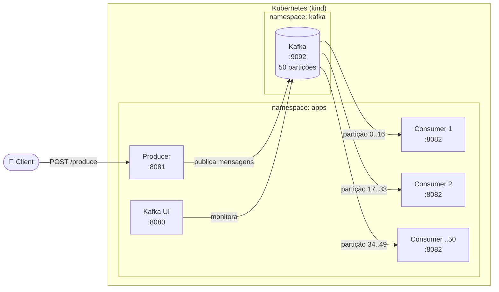
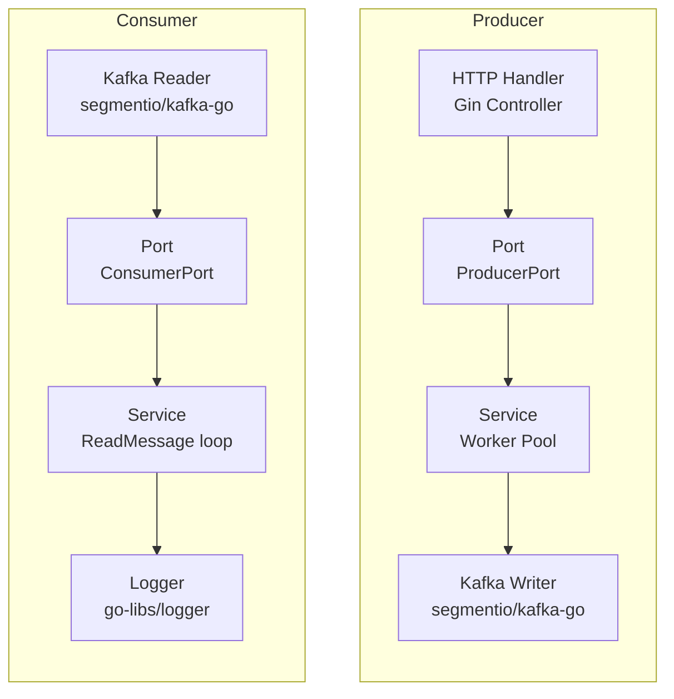
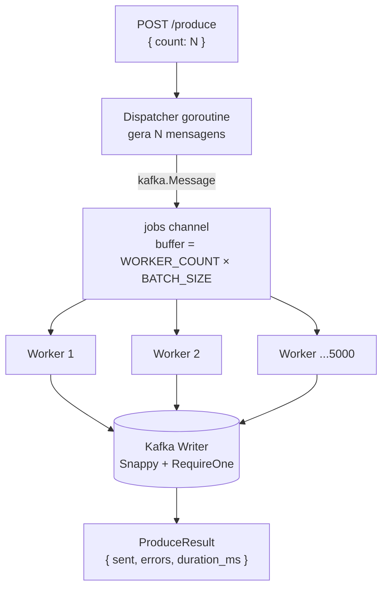
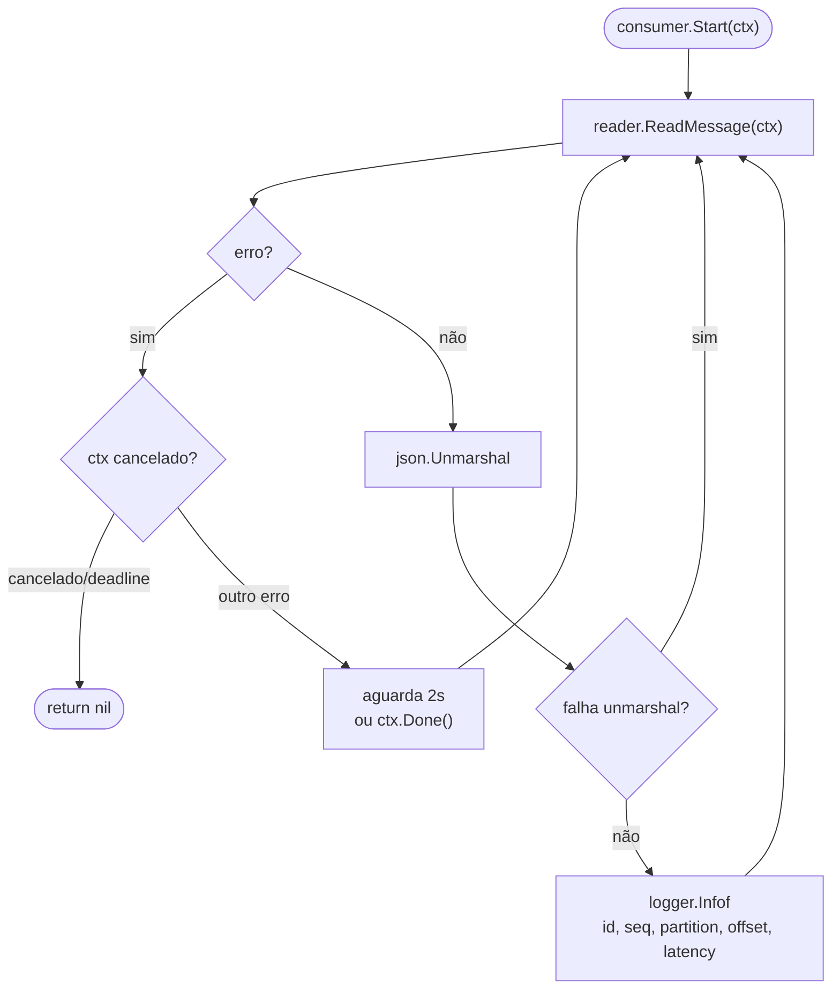
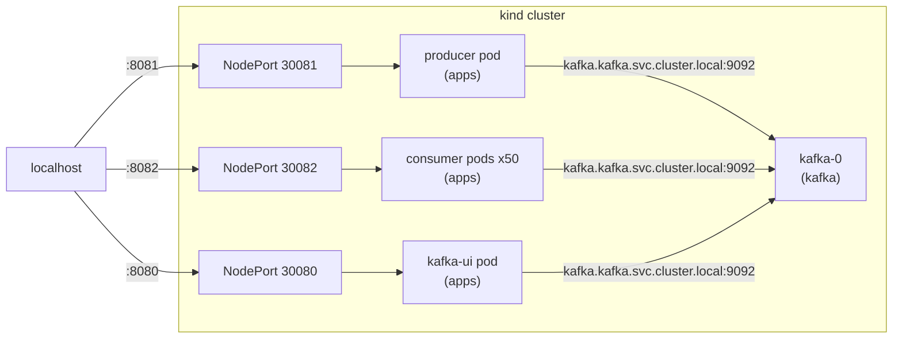

# kafka-go

Dois microsserviços Go independentes comunicando via Apache Kafka, arquitetura ports & adapters, rodando em Kubernetes local com kind.

---

## Visão geral



---

## Arquitetura: Ports & Adapters

Cada serviço é estruturado em camadas — a lógica de negócio não depende de frameworks ou do Kafka diretamente.



---

## Producer: Worker Pool

O producer usa um worker pool para maximizar o throughput ao publicar mensagens no Kafka.



- **5000 workers** consomem o channel em paralelo
- **Buffer** do channel = `WORKER_COUNT × BATCH_SIZE` para o dispatcher raramente bloquear
- Contagem de enviados/erros via `atomic.Int64`
- Workers sincronizados com `sync.WaitGroup`

---

## Consumer: Read Loop



- Cada pod consome **1 partição** do tópico
- Backoff de **2 segundos** em caso de erro de leitura
- `context.Canceled` e `context.DeadlineExceeded` encerram o loop graciosamente

---

## Fluxo de rede no Kubernetes



---

## Subir o ambiente

**Pré-requisitos:** Docker Desktop, kind, kubectl, Go 1.26+

```bash
bash scripts/deploy.sh
```

O script cria o cluster, builda as imagens, aplica os manifestos, cria o tópico com 50 partições e reinicia os consumers.

---

## Endpoints

| Serviço | URL |
|---------|-----|
| Producer API | http://localhost:8081 |
| Consumer health | http://localhost:8082/health |
| Kafka UI | http://localhost:8080 |

---

## Curls

```bash
# Produzir 10.000 mensagens
curl -s -X POST http://localhost:8081/produce \
  -H 'Content-Type: application/json' \
  -d '{"count": 10000}'

# Resposta
{"total_sent":10000,"total_errors":0,"duration_ms":163}

# Health checks
curl http://localhost:8081/health
curl http://localhost:8082/health
```

---

## Formato da mensagem

```go
type Message struct {
    ID        string    `json:"id"`         // UUID v4
    Payload   string    `json:"payload"`
    Timestamp time.Time `json:"timestamp"`  // usado para calcular latência
    Source    string    `json:"source"`     // "producer"
    SeqNumber int       `json:"seq_number"`
}
```

---

## Configuração

### Producer

| Variável | Padrão | Descrição |
|----------|--------|-----------|
| `KAFKA_BROKER` | `localhost:9092` | Endereço do broker |
| `KAFKA_TOPIC` | `demo-topic` | Tópico de destino |
| `WORKER_COUNT` | `5000` | Goroutines paralelas |
| `BATCH_SIZE` | `100` | Batch size do Kafka writer |
| `SERVER_PORT` | `8081` | Porta HTTP |

### Consumer

| Variável | Padrão | Descrição |
|----------|--------|-----------|
| `KAFKA_BROKER` | `localhost:9092` | Endereço do broker |
| `KAFKA_TOPIC` | `demo-topic` | Tópico a consumir |
| `KAFKA_GROUP_ID` | `demo-consumer-group` | Consumer group ID |
| `KAFKA_START_OFFSET` | `-2` (earliest) | Offset inicial |
| `SERVER_PORT` | `8082` | Porta HTTP |

---

## Estrutura do projeto

```
kafka-go/
├── producer/                        # Microsserviço producer (porta 8081)
│   ├── cmd/api/main.go              # Entrypoint, setup do logger e HTTP server
│   ├── config/config.go             # Leitura de env vars
│   ├── internal/
│   │   ├── controller/              # Handler HTTP — valida request, chama service
│   │   ├── model/message.go         # Struct de mensagem
│   │   ├── ports/producer_port.go   # Interface ProducerPort
│   │   ├── router/router.go         # Registro de rotas Gin
│   │   └── service/producer_service.go  # Worker pool + Kafka writer
│   └── Dockerfile
├── consumer/                        # Microsserviço consumer (porta 8082)
│   ├── cmd/api/main.go              # Entrypoint, goroutine de consume + HTTP server
│   ├── config/config.go             # Leitura de env vars
│   ├── internal/
│   │   ├── controller/              # Handler HTTP — apenas /health
│   │   ├── model/message.go         # Struct de mensagem
│   │   ├── ports/consumer_port.go   # Interface ConsumerPort
│   │   ├── router/router.go         # Registro de rotas Gin
│   │   └── service/consumer_service.go  # Loop ReadMessage + backoff
│   └── Dockerfile
├── k8s/
│   ├── kind-config.yaml             # Cluster kind com port mappings
│   └── base/
│       ├── kustomization.yaml       # Raiz Kustomize
│       ├── kafka/                   # StatefulSet + Service headless
│       └── apps/                    # Producer + Consumer (x50) + Kafka UI
├── docker/
│   └── docker-compose.yml           # Ambiente local sem K8s
├── scripts/
│   └── deploy.sh                    # Deploy completo no kind
└── docs/
    ├── runbook.md                   # Como rodar, logs, curls, comandos
    └── kubernetes.md                # Explicação de cada arquivo K8s
```

---

## Tech stack

| Concern | Lib |
|---------|-----|
| HTTP | [gin-gonic/gin](https://github.com/gin-gonic/gin) |
| Kafka client | [segmentio/kafka-go](https://github.com/segmentio/kafka-go) |
| UUID | [google/uuid](https://github.com/google/uuid) |
| Logger | [LeoRBlume/go-libs/logger](https://github.com/LeoRBlume/go-libs) |
| Kafka broker | Confluent Platform 7.6.1 — KRaft (sem Zookeeper) |
| Kafka UI | [provectuslabs/kafka-ui](https://github.com/provectus/kafka-ui) |
| Kubernetes local | [kind](https://kind.sigs.k8s.io/) + Kustomize |
